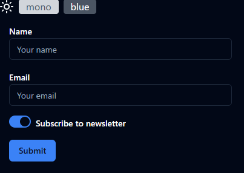
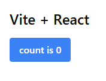
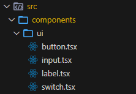
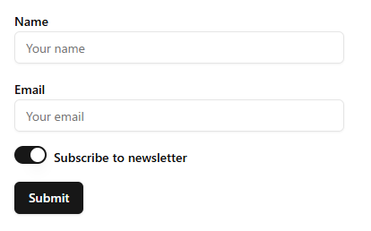
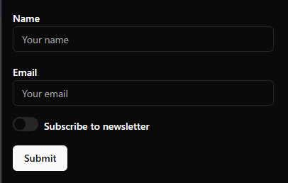
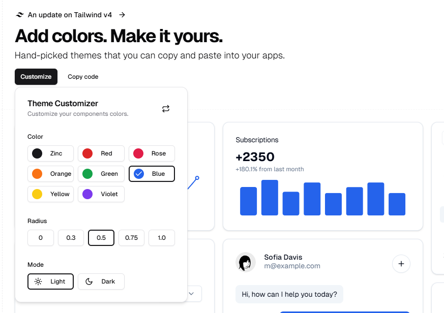
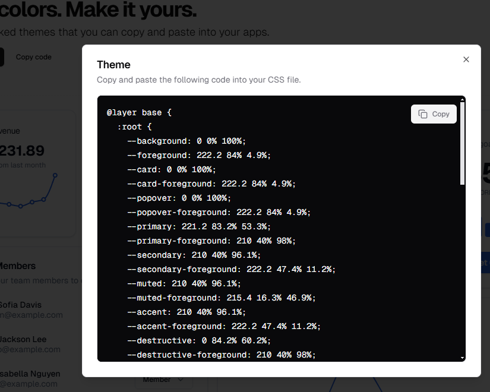
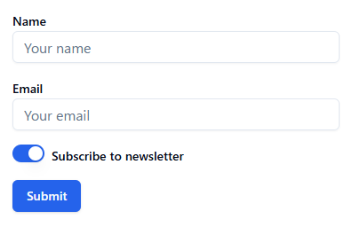
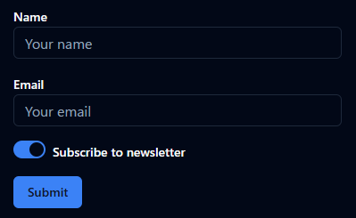
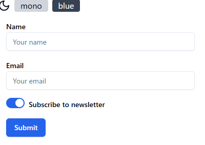

# Reactでshadcn/uiのダークモード、カラーテーマ切り替えを行うコンポーネントを作成する手順

## はじめに




[shadcn/ui](https://ui.shadcn.com/)は、tailwind CSSを利用したコンポーネントライブラリです

正しくは、コンポーネントライブラリを構築するライブラリですが、適切にスタイリングされているため色だけ変えればそのままコンポーネントライブラリとして利用することでできます

[shadcn/uiのThemesページ](https://ui.shadcn.com/themes)では、カラーテーマの切り替えと、ダークモードの切り替え両方ができるようになっていますが、具体的な切り替え方法の説明が見当たりませんでした

また、ググってもテーマ切り替え方法が見つからなかったため、手順をまとめました

* [gitHubのリポジトリ](https://github.com/murasuke/shadcn3-theme) (https://github.com/murasuke/shadcn3-theme)

* [gitHub Pages(今回作成したテーマ切り替えページ)](https://murasuke.github.io/shadcn3-theme/) (https://murasuke.github.io/shadcn3-theme/)


## 環境構築

### React18.3 + Vite

viteの最新版をインストール後、React19を18.3に変更します(shadcn/uiが一部対応できていないため)

```bash
npm create vite@latest shadcn3-theme -- --template react-ts
npm install
npm uninstall react react-dom
npm install react@18.3.1 react-dom@18.3.1
```

### Tailwind CSS3のインストール

[Tailwind CSS](https://tailwindcss.com/)の最新版はV4.0です(2025/02/11現在)が、shadcn/uiのインストーラーが対応していない(エラーになる)ため、V3系をインストールします

```bash
npm install -D tailwindcss@3 postcss autoprefixer
npx tailwindcss init -p
```


### [Install Tailwind CSS with Vite](https://v3.tailwindcss.com/docs/guides/vite)に従い、初期設定を行う

* `tailwind.config.js`のテンプレートパスを修正

tailwind.config.js
```diff
/** @type {import('tailwindcss').Config} */
export default {
  content: [
+    './index.html',
+    './src/**/*.{js,ts,jsx,tsx}'
  ],
  theme: {
    extend: {},
  },
  plugins: [],
};

```

* `index.css`の修正

`index.css`の内容を消して下記に入れ替えます

```css:index.css
@tailwind base;
@tailwind components;
@tailwind utilities;
```


* `App.jsx`の修正

Tailwindのインストール後確認のため、下記コードに置き換えます

```jsx:App.jsx
import { useState } from 'react';

function App() {
  const [count, setCount] = useState(0);

  return (
    <div className="p-4">
      <h1 className="text-2xl font-bold mb-4">Vite + React</h1>
      <button
        onClick={() => setCount((count) => count + 1)}
        className="bg-blue-500 hover:bg-blue-700 text-white font-bold py-2 px-4 rounded"
      >
        count is {count}
      </button>
    </div>
  );
}

export default App;

```
### Tailwindが正常にインストールできたことを確認

TailwindCSSが正常にインストールできていれば、下記のように表示されます



## [shadcn/ui](https://ui.shadcn.com/)のインストール

続いて、[shadcn/uiのインストール手順](https://ui.shadcn.com/docs/installation/vite)に従い、設定を行います

### `tsconfig.json`の編集

* `tsconfig.json`に`baseurl`と`paths`を追加します

```diff
{
  "files": [],
  "references": [
    { "path": "./tsconfig.app.json" },
    { "path": "./tsconfig.node.json" }
  ],
+  "compilerOptions": {
+   "baseUrl": ".",
+   "paths": {
+     "@/*": ["./src/*"]
+   }
+ }
}
```

* `tsconfig.app.json`にも同様に追加します
```diff
  "compilerOptions": {
+   "baseUrl": ".",
+   "paths": {
+     "@/*": ["./src/*"]
+   }
  }
```

### `vite.config.ts`の編集

* node.jsの型情報をインストールします
```
npm install -D @types/node
```

* `vite.config.ts`にエイリアスのパスを追加します

```diff
import { defineConfig } from 'vite'
+ import path from "path";
import react from '@vitejs/plugin-react'

// https://vite.dev/config/
export default defineConfig({
  plugins: [react()],
+ resolve: {
+   alias: {
+     "@": path.resolve(__dirname, "./src"),
+   },
+ },
})

```
### `shadcn/ui`のインストールを行う

* 途中で何回か質問があります。初期選択のままインストールしました

```
npx shadcn@latest init
✔ Preflight checks.
✔ Verifying framework. Found Vite.
✔ Validating Tailwind CSS.
✔ Validating import alias.
√ Which style would you like to use? » New York
√ Which color would you like to use as the base color? » Neutral
√ Would you like to use CSS variables for theming? ... no / yes
✔ Writing components.json.
✔ Checking registry.
✔ Updating tailwind.config.js
✔ Updating src\index.css
✔ Installing dependencies.
✔ Created 1 file:
  - src\lib\utils.ts

Success! Project initialization completed.
You may now add components.
```

### 基本的なコントロールをインストールして簡単な入力画面を作成する

コンポーネントが正しくインストールされたことを確認するため、簡単な入力画面を作成します

* `button input switch label`をインストールします
```
npx shadcn@latest add button input switch label
```
※ src/components/ui にファイルが配置されます




* `App.tsx`を下記ソースに置き換えます

```tsx
import { Label } from '@/components/ui/label';
import { Switch } from '@/components/ui/switch';
import { Input } from '@/components/ui/input';
import { Button } from '@/components/ui/button';

function App() {
  return (
    <div className="max-w-[400px]">
      <form className="m-4 space-y-4">
        <div>
          <Label htmlFor="name">Name</Label>
          <Input type="text" id="name" placeholder="Your name" />
        </div>
        <div>
          <Label htmlFor="email">Email</Label>
          <Input type="email" id="email" placeholder="Your email" />
        </div>
        <div>
          <Switch id="newsletter" />
          <Label htmlFor="newsletter" className="ml-2">
            Subscribe to newsletter
          </Label>
        </div>
        <Button type="submit">Submit</Button>
      </form>
    </div>
  );
}

export default App;

```

`shadcn/ui`が正常にインストールできていれば、下記のように表示されます




## テーマ切り替え(ダークモード、カラーテーマ)機能の作成

テーマ切り替えは複雑なため、下記の手順で行います
1. テーマ切り替え方法(ダークモード)
1. テーマ切り替え方法(カラーテーマ)と、テーマ毎のCSS定義追加
1. テーマ切り替えのためのコンポーネント作成


### 1. テーマ切り替え方法(ダークモード)

`tailwind.config.js`にダークモード切り替えの設定項目があります。ここでは、デフォルトの`class`をそのまま利用します

```js:tailwind.config.js
/** @type {import('tailwindcss').Config} */
export default {
    darkMode: ['class'], // ダークモード切り替え項目の指定
    content: ['./index.html', './src/**/*.{js,ts,jsx,tsx}'],
```

`class`を指定した場合、ルート要素(&lt;html&gt;)の`class`に`dark`を追加することで`dark`モードに切り替わります

ダークモードを指定すると`index.css`の`.dark`が適用されます

```
<html class="dark">
```


* `index.css`のダークモードスタイル定義について

`@layer base`に共通のベーススタイルを定義します。`.dark`は最初から設定されているため`class="dark"`を追加することで切り替えることができます


```css:index.css
@tailwind base;
@tailwind components;
@tailwind utilities;
@layer base {
  :root {
    --background: 0 0% 100%;
    --foreground: 0 0% 3.9%;
    --card: 0 0% 100%;
  /* 省略 */

  }
  .dark {
    --background: 0 0% 3.9%;
    --foreground: 0 0% 98%;
    --card: 0 0% 3.9%;
  /* 省略 */

  }
}


```

### 2. テーマ切り替え方法(カラーテーマ)と、テーマ毎のCSS定義追加

テーマカラーの切り替えには下記の２手順が必要です

1. `index.css`の`@layer base`にカラーテーマごとの色定義を追加（ライトモード用とダークモード用の2種類）
1. ルート要素(&lt;html&gt;)に、テーマ切り替えのための属性追加


#### 2-1. `index.css`の`@layer base`にカラーテーマごとの色定義を追加

カラーテーマを1から定義するのは大変なので、[shadcn/uiのtheme](https://ui.shadcn.com/themes)ページからcssをコピーして、セレクタを変更します


* `Customize`ボタンをクリックしてColorを選択する


* `Copy code`ボタンをクリックして、作成されたCSSをコピーします


* 通常色(:root)とダークモード(.dark)定義が定義されています

```css
@layer base {
  :root {
    --background: 0 0% 100%;
    --foreground: 222.2 84% 4.9%;
    --card: 0 0% 100%;
    /* 省略 */
  }

  .dark {
    --background: 222.2 84% 4.9%;
    --foreground: 210 40% 98%;
    --card: 222.2 84% 4.9%;
    /* 省略 */
  }
}

```


* セレクタを変更して、青用カラーテーマにします

ルート要素(&lt;html&gt;)に、属性`data-theme="blue"`が追加されたらテーマを適用するために、属性セレクター`[data-theme="blue"]`を追加します

```diff

@layer base {
-  :root {
+ [data-theme="blue"] {
    --background: 0 0% 100%;
    --foreground: 222.2 84% 4.9%;
    --card: 0 0% 100%;
    /* 省略 */
  }

-  .dark {
+ [data-theme="blue"].dark {
    --background: 222.2 84% 4.9%;
    --foreground: 210 40% 98%;
    --card: 222.2 84% 4.9%;
    /* 省略 */
  }
}

```

* `index.css`の既存のスタイル定義(.darkの次)に追加します


```css:index.css
@tailwind base;
@tailwind components;
@tailwind utilities;

@layer base {
  :root {
    --background: 0 0% 100%;
    --foreground: 0 0% 3.9%;
    --card: 0 0% 100%;
    /* 省略 */
  }

  .dark {
    --background: 0 0% 3.9%;
    --foreground: 0 0% 98%;
    --card: 0 0% 3.9%;
    /* 省略 */
  }

  [data-theme="blue"] {
    --background: 0 0% 100%;
    --foreground: 222.2 84% 4.9%;
    --card: 0 0% 100%;
    /* 省略 */
  }

  [data-theme="blue"].dark {
    --background: 222.2 84% 4.9%;
    --foreground: 210 40% 98%;
    --card: 222.2 84% 4.9%;
    /* 省略 */
  }
}


@layer base {
  * {
    @apply border-border;
  }

  body {
    @apply bg-background text-foreground;
  }
}
```

#### 2-2. ルート要素(&lt;html&gt;)に、テーマ切り替えのための属性追加


`<html>`に属性を追加して、テーマカラーが適用されることを確認します

```html
<html data-theme="blue">
```


```html
<html class="dark" data-theme="blue">
```



### 3. テーマ切り替えのためのコンポーネント作成

1. テーマ切り替えのためのProviderコンポーネントを作成

   * ProviderコンポーネントはReact Contextを利用して、テーマ変更関数(setTheme())を他コンポーネントへ提供します
   * テーマ変更関数はルート要素(&lt;html&gt;)の`class`と属性`data-theme`を変更します
   * 設定をブラウザに保存(localStorage)して、次回起動時にテーマ選択状態を復元します

2. テーマ切り替え用のUIコンポーネントを作成

   * ダークモード切り替えボタンと、カラーテーマの切り替えボタンを持つコンポーネントを作成します
   * Context経由で取得したテーマ変更関数(setTheme())を呼び出してテーマ切り替えを行います


#### 3-1. テーマ切り替えのためのProviderコンポーネントを作成

`components/ThemeProvider.tsx`

ソースコードのコメントを参照

```typescript:components/ThemeProvider.tsx
import { createContext, useEffect, useState } from 'react';

// カラーテーマ
export const themes = ['mono', 'blue'] as const;

// テーマ定義
type Theme = {
  dark_mode: boolean; // ダークモード
  color: (typeof themes)[number]; // カラーテーマ名
};

interface ThemeContextProps {
  theme: Theme;
  setTheme: (theme: Theme) => void;
}

// Contexを作成
export const ThemeContext = createContext<ThemeContextProps | undefined>(
  undefined
);

/**
 * テーマ切り替えのためのProvider
 */
export function ThemeProvider({ children }: { children: React.ReactNode }) {
  const [theme, setTheme] = useState<Theme>(() => {
    // ブラウザに保存したテーマを復元
    const defalutTheme: Theme = { dark_mode: false, color: 'mono' };
    const item = localStorage.getItem('shadcn-theme');
    return item ? JSON.parse(item) : defalutTheme;
  });

  useEffect(() => {
    // <html>のclassに'dark'をセットすることでダークモードのスタイルが適用される
    // (tailwind.config.js で「darkMode: ['class']」を指定しておく)
    document.documentElement.classList.remove('dark');
    if (theme.dark_mode) {
      document.documentElement.classList.add('dark');
    }

    // テーマカラーの選択
    // <html>要素に「data-theme="<テーマカラー名>"」を追加する
    // (index.cssのセレクタも合わせて変更すること)
    document.documentElement.setAttribute('data-theme', theme.color);

    // テーマをブラウザに保存
    localStorage.setItem('shadcn-theme', JSON.stringify(theme));
  }, [theme]);

  // Provider配下のコンポーネントでは、Contex経由で現在選択中のテーマ(theme)と、その変更関数(setTheme())を受け取ることができる
  return (
    <ThemeContext.Provider value={{ theme, setTheme }}>
      {children}
    </ThemeContext.Provider>
  );
}

export default ThemeProvider;

```
#### 3-2. テーマ切り替え用のUIコンポーネントを作成

`components/ThemeSwitcher.tsx`

ソースコードのコメントを参照

```tsx:components/ThemeSwitcher.tsx
import { useContext } from 'react';
import { Sun, Moon } from 'lucide-react';
import { ThemeContext, themes } from '@/components/ThemeProvider';

// テーマ変更UI
export default function ThemeSwitcher() {
  // Context経由で現在のThemeと、変更関数を受け取る
  const context = useContext(ThemeContext);
  if (!context) return null;
  const { theme, setTheme } = context;

  return (
    <div className="flex flex-wrap space-x-2">
      {/* ダークモード/ライトモード切り替えボタン */}
      {theme.dark_mode ? (
        <Sun onClick={() => setTheme({ ...theme, dark_mode: false })} />
      ) : (
        <Moon onClick={() => setTheme({ ...theme, dark_mode: true })} />
      )}
      {/* カラーテーマ名の配列を元に切り替えボタンを作成する */}
      {themes.map((t) => (
        <button
          key={t}
          onClick={() => setTheme({ ...theme, color: t })}
          className={`px-3 rounded ${
            theme.color === t
              ? 'bg-gray-700 text-white dark:bg-gray-600'
              : 'bg-gray-300 dark:text-gray-600'
          }`}
        >
          {t}
        </button>
      ))}
    </div>
  );
}

```

### テーマ切り替えコンポーネント動作確認

* 上記のコンポーネントを`main.tsx`に組み込みます

```tsx
import { StrictMode } from 'react';
import { createRoot } from 'react-dom/client';
import ThemeProvider from './components/ThemeProvider.tsx';
import ThemeSwitcher from './components/ThemeSwitcher.tsx';
import './index.css';
import App from './App.tsx';

createRoot(document.getElementById('root')!).render(
  <StrictMode>
    <ThemeProvider>
      <ThemeSwitcher />
      <App />
    </ThemeProvider>
  </StrictMode>
);

```

`太陽/月` アイコンクリックでダークモードの切り替え、`blueボタン`でカラーテーマの切り替えが行えることを確認します

* ライトモード & blue



* ダークモード & blue


## GitHub Pagesで公開(おまけ)

gitHubにリポジトリを作成＆push後、作成したWebアプリを[gitHub Pages](https://docs.github.com/ja/pages)で公開します

1. [gh-pages](https://www.npmjs.com/package/gh-pages)をインストールする

```bash
npm i gh-pages
```

2.  `package.json`のscriptsにデプロイ用コマンドを追加

```json:package.json
{
  "scripts": {
    "deploy": "gh-pages -d dist"
  }
```

3. `vite.config.ts`に`base`の設定を追加する

`https://<USERNAME>.github.io/<リポジトリ名>/` にデプロイする場合は`base`に`/<リポジトリ名>/`をセットする

```diff
import { defineConfig } from 'vite';
import path from 'path';
import react from '@vitejs/plugin-react';

// https://vite.dev/config/
export default defineConfig({
  plugins: [react()],
+  base: '/shadcn3-theme/',
  resolve: {
    alias: {
      '@': path.resolve(__dirname, './src'),
    },
  },
});

```

* デプロイ実行

リリースビルド`npm run build`行った後、デプロイを行います

```bash
npm run build
npm run deploy

> shadcn3-theme@0.0.0 deploy
> gh-pages -d dist

Published
```


* 動作確認

下記URLでテーマ切り替えサンプルアプリを試すことができるようになりました

https://murasuke.github.io/shadcn3-theme/
